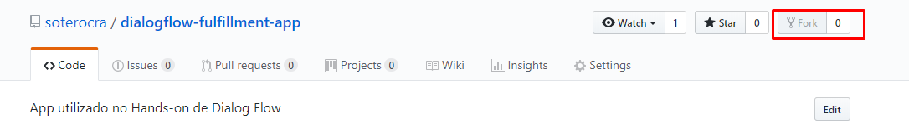
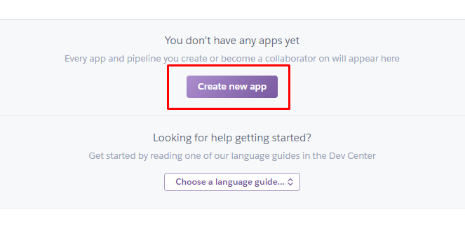
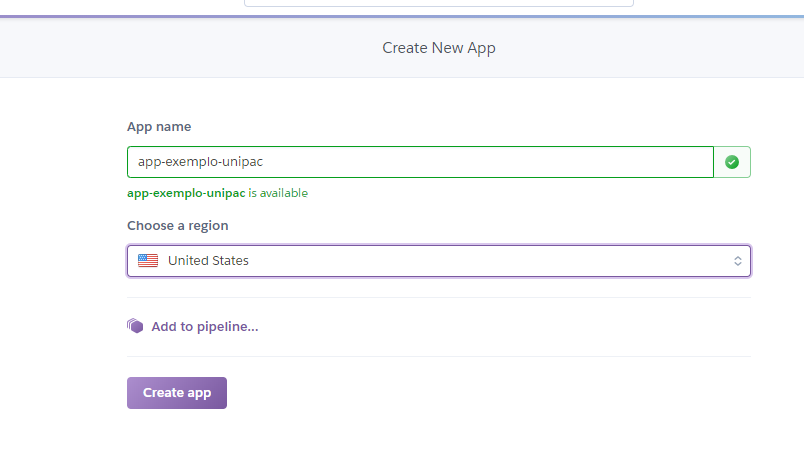
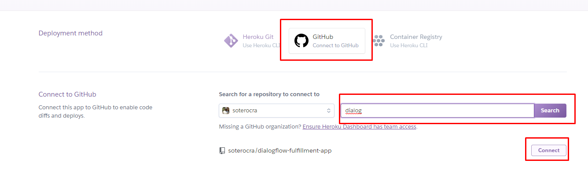
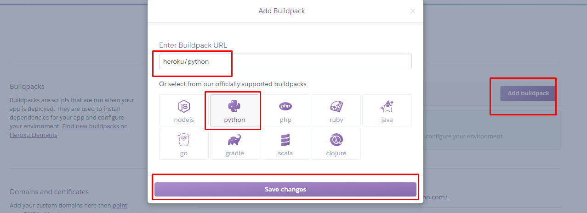
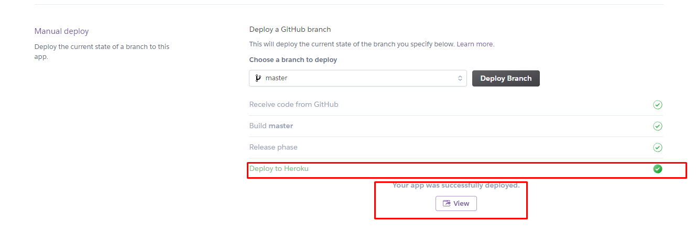
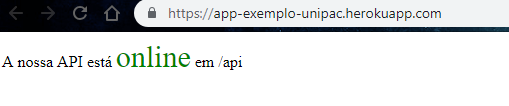

# DialogFlow Fullfielment

Este é o proje base para o Hands-On desenvolvido pela [CrudTec](https://crudtec.com.br) para fins de estudo.

Contribuições no projeto são bem-vindas.


## Crie o seu bot cognitivo

Para criar o bot exemplo do Hands on, siga os passos dessa sessão. Em resumo subir o ambiente no Heroku e basta importar o arquivo exemplo do DialogFlow e.

### 1 - Configurar Heroku

1 . Faça o fork desse projeto para sua conta


 
Ou simplesmente faça o download do projeto como zip e realize a extração.

2 . Faça o login na sua conta Heroku
```angular2html
https://www.heroku.com/
```

3 . Procure a opção de criar um novo aplicativo:


4 . Escolha um nome que estiver disponível:

 
E clique em create app.
 
5 . Na próxima tela conecte sua conta do Heroku com a do GIT HUB.



Aproveite e já insira também o nome do repositório e conecte ele a este aplicativo do Heroku.

6 . Agora na aba Settings em Buildpacks vamos dizer ao Heroku em qual linguagem foi desenvolvida nossa aplicação.



Salve as configurações e retorne para a aba Deploy.

7 . Vamos marcar deploy automatico para agilizar o desenvolvimento e também vamos pedir para que seja feito um deploy imediatado.


Você deve ver um Log de carregamento da aplicação, ao finalizar é possível visualizar a mensagem "Deploy to Heroku" em verde.

Para obter o nosso end-point da aplicação basta clicar no botão "View" que apareceu abaixo do log:



8 . Ao clicar já é possível visualizar uma mensagem que configuramos no projeto dizendo que nossa API está online.




### 2 - Configurar DialogFlow

1. Faça login no [DialogFlow](https://console.dialogflow.com/api-client/#/login)
2. Clique em "Create new agent"
   - [x] Default Language -> pt-br
   - [x] CREATE
3. Clique em "Settings"
4. Em General -> Marque "V1 API"
5. Em Export and Import -> Import From Zip o Arquivo [Exemplo](https://github.com/soterocra/dialogflow-fulfillment-app/blob/master/DialogFlow-Cognition/Presentation_CrudTec.zip)
6. No menu lateral clique em "Fullfillment"
   - [x] Habilite o Webhook -> Enable
   - [x] Inserir o end-point gerado pelo heroku /api

## Suporte

[Rafael Sotero](https://github.com/soterocra) e [Wladimir Neto](https://github.com/wladneto)

ou  falecom@crudtec.com.br
